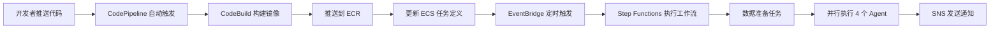

# AWS 托管服务集成指南

本文档说明如何使用 AWS 托管服务替代手动脚本执行和镜像构建流程。

---

## 问题 1：脚本固化到 AWS - 编排与调度

### 方案 A：AWS Step Functions（推荐）⭐

**优势**：可视化工作流、自动重试、并行执行、状态管理

#### 1.1 创建 Step Functions 状态机

```bash
# 使用提供的 JSON 定义创建状态机
aws stepfunctions create-state-machine \
  --name "ai-trader-workflow" \
  --definition file://docs/AWS_STEP_FUNCTIONS_WORKFLOW.json \
  --role-arn "arn:aws:iam::YOUR_ACCOUNT:role/StepFunctionsExecutionRole"
```

#### 1.2 通过控制台可视化编辑（白屏服务）

1. 打开 **AWS Step Functions 控制台**
   - https://console.aws.aws.amazon.com/states/
2. 选择刚创建的状态机 `ai-trader-workflow`
3. 点击 **"编辑"** → 使用 **Workflow Studio** 拖拽式编辑
4. 可视化调整：
   - 添加/删除并行任务
   - 修改重试策略
   - 添加错误处理分支
   - 配置通知（SNS/邮件）

#### 1.3 执行状态机

```bash
# 方式 1：通过 CLI 执行
aws stepfunctions start-execution \
  --state-machine-arn "arn:aws:states:REGION:ACCOUNT:stateMachine:ai-trader-workflow" \
  --input '{
    "subnets": ["subnet-xxx"],
    "securityGroups": ["sg-xxx"],
    "dataPrepCommand": ["configs/astock_config_hourly.json"]
  }'

# 方式 2：通过控制台执行
# 访问控制台 → 点击 "开始执行" → 输入参数
```

#### 1.4 定时执行（EventBridge 集成）

```bash
# 创建 EventBridge 规则，每天 9:30 执行
aws events put-rule \
  --name "ai-trader-daily-execution" \
  --schedule-expression "cron(30 9 ? * MON-FRI *)" \
  --state ENABLED

# 设置目标为 Step Functions
aws events put-targets \
  --rule "ai-trader-daily-execution" \
  --targets "Id=1,Arn=arn:aws:states:REGION:ACCOUNT:stateMachine:ai-trader-workflow,RoleArn=arn:aws:iam::ACCOUNT:role/EventBridgeRole"
```

#### 1.5 Step Functions 可视化界面功能

- ✅ **拖拽式编辑器**：Workflow Studio
- ✅ **实时执行监控**：查看每个步骤的状态
- ✅ **执行历史**：保留所有执行记录
- ✅ **错误追踪**：点击失败步骤查看详细日志
- ✅ **输入/输出查看**：每个步骤的数据流转
- ✅ **集成 CloudWatch**：自动记录日志

**控制台截图位置**：
- 状态机列表：https://console.aws.amazon.com/states/home#/statemachines
- 执行详情：点击任意执行 → 查看图形化流程图

---

### 方案 B：AWS Lambda + EventBridge

**适用场景**：更灵活的自定义逻辑

#### 创建 Lambda 函数

```python
# lambda_trigger_ecs_workflow.py
import boto3
import json
import os

ecs = boto3.client('ecs')
sns = boto3.client('sns')

CLUSTER = os.environ['ECS_CLUSTER']
SUBNET = os.environ['ECS_SUBNET']
SECURITY_GROUP = os.environ['ECS_SECURITY_GROUP']
SNS_TOPIC = os.environ['SNS_TOPIC_ARN']

def lambda_handler(event, context):
    try:
        # 1. 运行数据准备任务
        print("Starting data preparation task...")
        data_prep_response = ecs.run_task(
            cluster=CLUSTER,
            taskDefinition='trader-data-preparation',
            launchType='FARGATE',
            networkConfiguration={
                'awsvpcConfiguration': {
                    'subnets': [SUBNET],
                    'securityGroups': [SECURITY_GROUP],
                    'assignPublicIp': 'ENABLED'
                }
            }
        )
        
        data_prep_arn = data_prep_response['tasks'][0]['taskArn']
        print(f"Data prep task started: {data_prep_arn}")
        
        # 2. 等待数据准备完成（Lambda 异步处理需要额外逻辑）
        # 建议使用 Step Functions 而不是 Lambda 等待
        
        return {
            'statusCode': 200,
            'body': json.dumps({
                'message': 'Workflow triggered successfully',
                'dataPrepTaskArn': data_prep_arn
            })
        }
        
    except Exception as e:
        print(f"Error: {str(e)}")
        sns.publish(
            TopicArn=SNS_TOPIC,
            Subject='❌ AI-Trader Lambda 触发失败',
            Message=str(e)
        )
        raise
```

**部署 Lambda**：
```bash
# 打包代码
zip lambda_function.zip lambda_trigger_ecs_workflow.py

# 创建函数
aws lambda create-function \
  --function-name ai-trader-trigger \
  --runtime python3.11 \
  --role arn:aws:iam::ACCOUNT:role/LambdaECSExecutionRole \
  --handler lambda_trigger_ecs_workflow.lambda_handler \
  --zip-file fileb://lambda_function.zip \
  --timeout 300 \
  --environment Variables="{ECS_CLUSTER=trader-cluster,ECS_SUBNET=subnet-xxx,ECS_SECURITY_GROUP=sg-xxx,SNS_TOPIC_ARN=arn:aws:sns:...}"
```

---

### 方案 C：AWS Systems Manager (SSM) - Run Command

**适用场景**：需要在 EC2 实例上执行脚本

```bash
# 在 EC2 上执行 shell 脚本
aws ssm send-command \
  --document-name "AWS-RunShellScript" \
  --targets "Key=tag:Name,Values=trader-server" \
  --parameters 'commands=["/home/ec2-user/AI-Trader/scripts/aws_ecs_run_all.sh"]'
```

**白屏操作**：
1. AWS Systems Manager 控制台 → Run Command
2. 选择 `AWS-RunShellScript`
3. 输入命令：`bash /path/to/aws_ecs_run_all.sh`
4. 选择目标实例
5. 点击 "Run"

---

## 问题 2：镜像构建与推送 - CI/CD 自动化

### 方案 A：AWS CodePipeline + CodeBuild（推荐）⭐

**完整的 CI/CD 流水线**：代码提交 → 自动构建 → 推送镜像 → 更新任务定义

#### 2.1 创建 buildspec.yml

```yaml
# buildspec.yml - 放在项目根目录
version: 0.2

phases:
  pre_build:
    commands:
      - echo Logging in to Amazon ECR...
      - aws ecr get-login-password --region $AWS_DEFAULT_REGION | docker login --username AWS --password-stdin $AWS_ACCOUNT_ID.dkr.ecr.$AWS_DEFAULT_REGION.amazonaws.com
      - REPOSITORY_URI=$AWS_ACCOUNT_ID.dkr.ecr.$AWS_DEFAULT_REGION.amazonaws.com/trader-app
      - FRONTEND_REPOSITORY_URI=$AWS_ACCOUNT_ID.dkr.ecr.$AWS_DEFAULT_REGION.amazonaws.com/trader-frontend
      - IMAGE_TAG=${CODEBUILD_RESOLVED_SOURCE_VERSION:-latest}
  
  build:
    commands:
      - echo Build started on `date`
      - echo Building the Docker images...
      
      # 构建主应用镜像
      - docker build -t $REPOSITORY_URI:latest -f Dockerfile .
      - docker tag $REPOSITORY_URI:latest $REPOSITORY_URI:$IMAGE_TAG
      
      # 构建前端镜像
      - docker build -t $FRONTEND_REPOSITORY_URI:latest -f Dockerfile.frontend .
      - docker tag $FRONTEND_REPOSITORY_URI:latest $FRONTEND_REPOSITORY_URI:$IMAGE_TAG
  
  post_build:
    commands:
      - echo Build completed on `date`
      - echo Pushing the Docker images...
      
      # 推送主应用镜像
      - docker push $REPOSITORY_URI:latest
      - docker push $REPOSITORY_URI:$IMAGE_TAG
      
      # 推送前端镜像
      - docker push $FRONTEND_REPOSITORY_URI:latest
      - docker push $FRONTEND_REPOSITORY_URI:$IMAGE_TAG
      
      # 生成镜像定义文件（用于 ECS 部署）
      - printf '[{"name":"agent","imageUri":"%s"}]' $REPOSITORY_URI:$IMAGE_TAG > imagedefinitions.json

artifacts:
  files: 
    - imagedefinitions.json
```

#### 2.2 创建 CodeBuild 项目（通过控制台 - 白屏服务）

1. **打开 CodeBuild 控制台**
   - https://console.aws.amazon.com/codesuite/codebuild/projects
   
2. **创建构建项目**：
   - 项目名称：`ai-trader-build`
   - 源提供商：GitHub / CodeCommit / S3
   - 环境：
     - 托管映像：`aws/codebuild/standard:7.0`
     - 特权模式：✅ 启用（Docker 构建需要）
     - 环境变量：
       - `AWS_ACCOUNT_ID`: 你的账户 ID
       - `AWS_DEFAULT_REGION`: us-east-1
   - Buildspec：使用 `buildspec.yml`
   - 工件：无需配置（镜像推送到 ECR）

3. **点击 "创建构建项目"**

#### 2.3 创建 CodePipeline（全自动化流水线）

1. **打开 CodePipeline 控制台**
   - https://console.aws.amazon.com/codesuite/codepipeline/pipelines

2. **创建流水线**：
   - 流水线名称：`ai-trader-pipeline`
   
3. **源阶段**（Source）：
   - 源提供商：GitHub Version 2 / CodeCommit
   - 仓库：`your-repo/AI-Trader`
   - 分支：`main`
   - 检测选项：✅ 使用 CloudWatch Events（自动触发）

4. **构建阶段**（Build）：
   - 构建提供商：AWS CodeBuild
   - 项目名称：选择 `ai-trader-build`

5. **部署阶段**（Deploy - 可选）：
   - 部署提供商：Amazon ECS
   - 集群名称：`trader-cluster`
   - 服务名称：`trader-frontend`（自动更新前端服务）

6. **点击 "创建流水线"**

#### 2.4 自动化效果

✅ **代码推送到 GitHub/CodeCommit** → 自动触发 Pipeline  
✅ **自动构建 Docker 镜像** → 推送到 ECR  
✅ **自动更新 ECS 任务定义** → 前端服务自动部署新版本  
✅ **通知** → SNS/邮件通知构建结果

#### 2.5 手动触发构建（白屏操作）

**方式 1：CodePipeline 控制台**
- 打开流水线 → 点击 "发布更改"

**方式 2：CodeBuild 控制台**
- 打开构建项目 → 点击 "开始构建"

---

### 方案 B：AWS CodeCommit + CodeBuild + EventBridge

**更轻量的方案**（不使用 CodePipeline）

```bash
# 创建 EventBridge 规则，监听 CodeCommit 推送事件
aws events put-rule \
  --name "trigger-build-on-commit" \
  --event-pattern '{
    "source": ["aws.codecommit"],
    "detail-type": ["CodeCommit Repository State Change"],
    "detail": {
      "event": ["referenceCreated", "referenceUpdated"],
      "referenceType": ["branch"],
      "referenceName": ["main"]
    }
  }'

# 设置目标为 CodeBuild
aws events put-targets \
  --rule "trigger-build-on-commit" \
  --targets "Id=1,Arn=arn:aws:codebuild:REGION:ACCOUNT:project/ai-trader-build,RoleArn=arn:aws:iam::ACCOUNT:role/EventBridgeCodeBuildRole"
```

---

### 方案 C：GitHub Actions + ECR（混合方案）

如果代码托管在 GitHub，可以使用 GitHub Actions 构建并推送到 AWS ECR。

```yaml
# .github/workflows/deploy-to-ecr.yml
name: Build and Push to ECR

on:
  push:
    branches: [ main ]

jobs:
  build:
    runs-on: ubuntu-latest
    steps:
      - uses: actions/checkout@v3
      
      - name: Configure AWS credentials
        uses: aws-actions/configure-aws-credentials@v2
        with:
          aws-access-key-id: ${{ secrets.AWS_ACCESS_KEY_ID }}
          aws-secret-access-key: ${{ secrets.AWS_SECRET_ACCESS_KEY }}
          aws-region: us-east-1
      
      - name: Login to Amazon ECR
        id: login-ecr
        uses: aws-actions/amazon-ecr-login@v1
      
      - name: Build and push images
        env:
          ECR_REGISTRY: ${{ steps.login-ecr.outputs.registry }}
          IMAGE_TAG: ${{ github.sha }}
        run: |
          # 主应用镜像
          docker build -t $ECR_REGISTRY/trader-app:latest -f Dockerfile .
          docker tag $ECR_REGISTRY/trader-app:latest $ECR_REGISTRY/trader-app:$IMAGE_TAG
          docker push $ECR_REGISTRY/trader-app:latest
          docker push $ECR_REGISTRY/trader-app:$IMAGE_TAG
          
          # 前端镜像
          docker build -t $ECR_REGISTRY/trader-frontend:latest -f Dockerfile.frontend .
          docker tag $ECR_REGISTRY/trader-frontend:latest $ECR_REGISTRY/trader-frontend:$IMAGE_TAG
          docker push $ECR_REGISTRY/trader-frontend:latest
          docker push $ECR_REGISTRY/trader-frontend:$IMAGE_TAG
      
      - name: Trigger ECS deployment
        run: |
          aws ecs update-service \
            --cluster trader-cluster \
            --service trader-frontend \
            --force-new-deployment
```

---

## 完整的白屏服务工作流（推荐组合）

### 场景：从代码提交到自动执行交易



### 涉及的 AWS 服务

| 服务 | 作用 | 白屏操作 |
|-----|------|---------|
| **CodePipeline** | CI/CD 流水线 | ✅ 可视化编辑流水线 |
| **CodeBuild** | 构建 Docker 镜像 | ✅ 手动触发构建 |
| **ECR** | 存储镜像 | ✅ 查看镜像列表 |
| **Step Functions** | 编排 ECS 任务 | ✅ 拖拽式编辑工作流 |
| **EventBridge** | 定时调度 | ✅ 配置 Cron 表达式 |
| **ECS** | 运行容器 | ✅ 查看任务状态 |
| **SNS** | 通知 | ✅ 配置邮件/短信 |
| **CloudWatch** | 日志监控 | ✅ 查看日志流 |

---

## 快速开始检查清单

### 1. 镜像构建自动化
- [ ] 创建 ECR 仓库：`trader-app`, `trader-frontend`
- [ ] 创建 `buildspec.yml` 文件
- [ ] 在 CodeBuild 控制台创建构建项目
- [ ] 在 CodePipeline 控制台创建流水线
- [ ] 推送代码测试自动构建

### 2. 任务编排自动化
- [ ] 在 Step Functions 控制台创建状态机
- [ ] 使用 Workflow Studio 可视化编辑
- [ ] 测试手动执行工作流
- [ ] 在 EventBridge 创建定时规则
- [ ] 配置 SNS 通知

### 3. 完整集成测试
- [ ] 推送代码触发 Pipeline
- [ ] 等待镜像构建完成
- [ ] 手动触发 Step Functions
- [ ] 验证所有任务成功执行
- [ ] 检查通知是否收到

---

## 成本估算

### Step Functions
- 状态转换：$0.025 / 1000 次
- 每天执行 1 次 × 30 天 = **$0.001/月**

### CodeBuild
- build.general1.small: $0.005/分钟
- 每次构建 10 分钟 × 30 次/月 = **$1.5/月**

### EventBridge
- 规则调用：免费（前 100 万次）

### ECS Fargate
- 按实际运行时间计费（参考现有成本）

**总计额外成本**：~$2/月（CI/CD 部分）

---

## 总结

### 问题 1 答案：✅ 可以固化到 AWS

- **最佳方案**：Step Functions + EventBridge
- **白屏服务**：Step Functions Workflow Studio（完全可视化）
- **优势**：无需维护脚本、自动重试、并行执行、状态持久化

### 问题 2 答案：✅ 可以托管到 AWS

- **最佳方案**：CodePipeline + CodeBuild
- **白屏服务**：CodePipeline 控制台（拖拽式配置）
- **优势**：代码推送自动构建、自动推送镜像、自动部署

### 推荐配置

1. **开发阶段**：使用 shell 脚本快速迭代
2. **生产环境**：迁移到 Step Functions + CodePipeline
3. **日常维护**：通过控制台白屏操作，无需命令行

所有服务都有完善的 Web 控制台，支持可视化编辑和监控！
